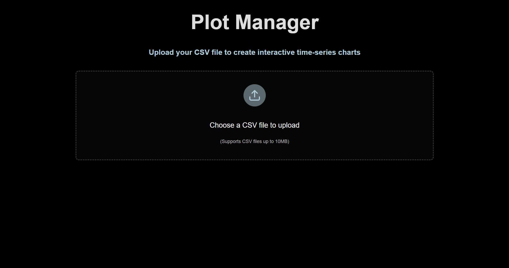
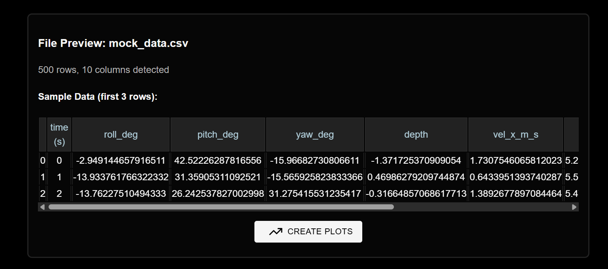
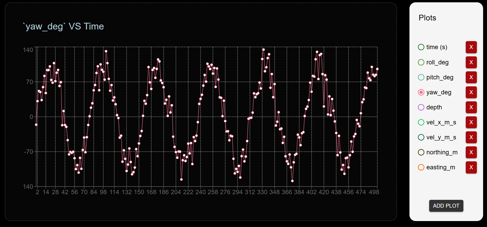
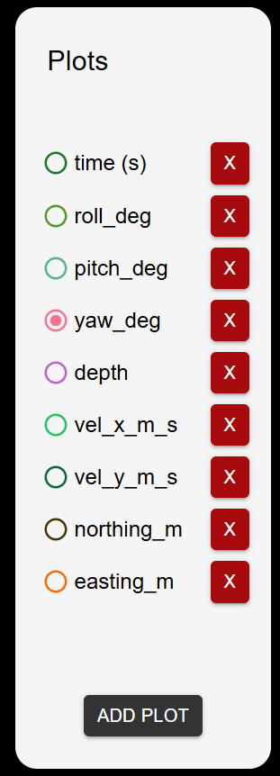
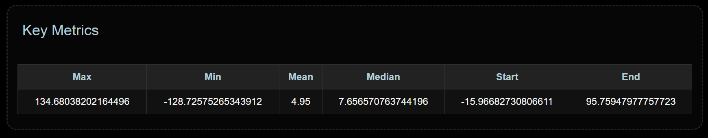

# Vatn Systems Dashboard

## Overview

This codebase contains the frontend code for Vatn Systems's Full-Stack Intern take-home project. Written with React and TypeScript, this application allows users to upload CSV files and view time-based data in the form of line graphs.

## Run Locally

To run this application locally, simply clone the repository and navigate to the `vatn-systems-dashboard` subdirectory. Then, run the following command:

```npm run dev```

Each of the features for this application are accessible under two different routes:
 - `/upload` : Route to upload files
 - `/plots` : Route to view all plot-related data

## Core Features

### Upload CSV Files

Below illustrates the page upon navigating to the `/upload` path. As its name suggests, it represents the page of the application where users may upload CSV files. 



Upon uploading any CSV file, a preview of the first three rows of content will be displayed.



### Manage Plots

The `/plots` path contains all the plots and corresponding metrics. All plots are displayed on one chart, but can be toggled with a control panel on the right of the page:



The control panel lists out all plots, each of which can be deleted (deleting them only temporarily deletes them, as all of the plot data is cached in `localStorage` in place of a database). Moreover, the bottom of the control panel features a button to add more plots. 



Finally, the bottom of the page features all the key metrics for each time. 
NOTE: To deal with the tremendous amount of data, a customizable downsample rate is applied upon uploading CSV files. As a result, depending on the downsample rate, these values might be inaccurate. In the future, these metrics could be calculated on the backend, minimizing the memory load of a user's browser.

